# Battery Usage Analysis — Cohort Report

Generated over **20 users** from bucket `rprm-alpha-01`.

## Cohort summary

Distribution of key metrics across the cohort:

| metric | mean | median | std | min | max |
|---|---|---|---|---|---|
| observation_days | 279.86 | 230.99 | 239.65 | 27.78 | 933.23 |
| n_samples | 4139.65 | 2086.50 | 4518.62 | 291.00 | 16556.00 |
| soh_design_pct | 94.74 | 99.70 | 9.85 | 63.71 | 103.35 |
| soh_peak_pct | 93.79 | 99.59 | 9.73 | 63.66 | 100.00 |
| capacity_fade_pct | 6.21 | 0.41 | 9.73 | 0.00 | 36.34 |
| cycle_count_last | 65.90 | 22.50 | 89.03 | 4.00 | 316.00 |
| cycles_per_year | 67.14 | 58.40 | 45.14 | 2.60 | 164.01 |
| fade_pct_per_year | 9.40 | 7.50 | 8.95 | 0.24 | 25.94 |
| fade_pct_per_100_cycles | 18.46 | 12.14 | 23.33 | 1.74 | 93.03 |
| ac_time_ratio | 0.70 | 0.76 | 0.21 | 0.28 | 0.97 |
| mean_pct_remaining | 88.80 | 91.20 | 7.42 | 72.79 | 98.22 |
| time_ratio_below_20pct | 0.01 | 0.01 | 0.02 | 0.00 | 0.07 |
| time_ratio_full_on_ac | 0.55 | 0.60 | 0.25 | 0.16 | 0.89 |
| n_discharge_sessions | 146.45 | 64.50 | 173.13 | 4.00 | 623.00 |
| mean_dod_pct | 24.04 | 23.09 | 10.13 | 7.70 | 40.60 |
| median_drain_pct_per_hr | 8.72 | 6.63 | 5.72 | 1.67 | 19.55 |
| hours_high_temp_last | 0.25 | 0.00 | 0.91 | 0.00 | 4.00 |
| frac_awake_high_temp | 0.00 | 0.00 | 0.00 | 0.00 | 0.00 |

## Cohort figures

### Soh

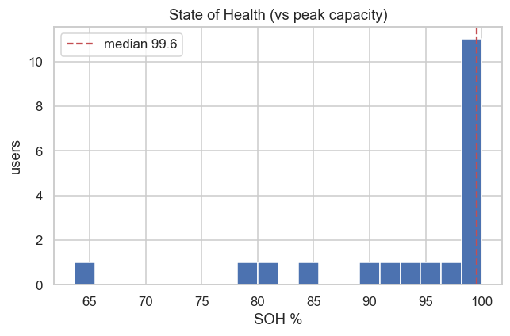

### Fade

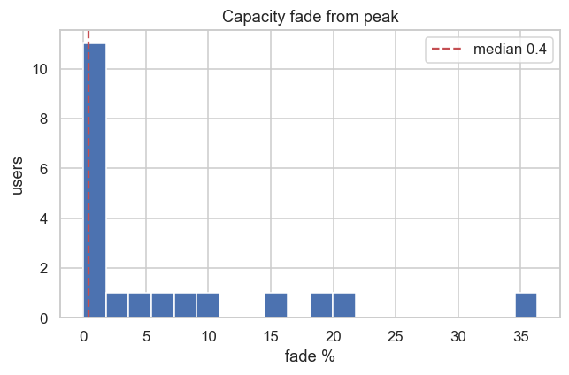

### Ac Ratio

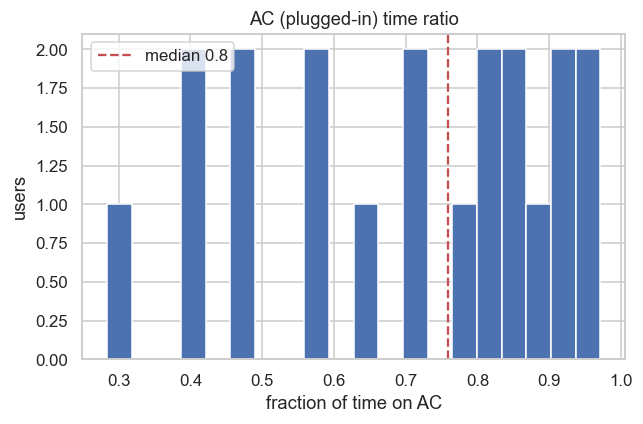

### Cycles Per Year

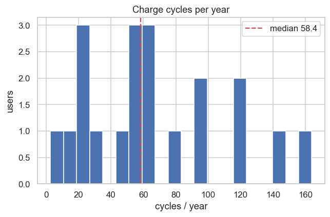

### Dod

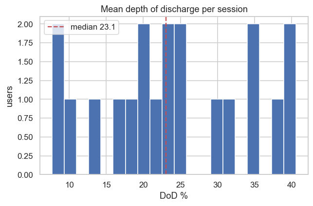

### Soh Vs Cycles

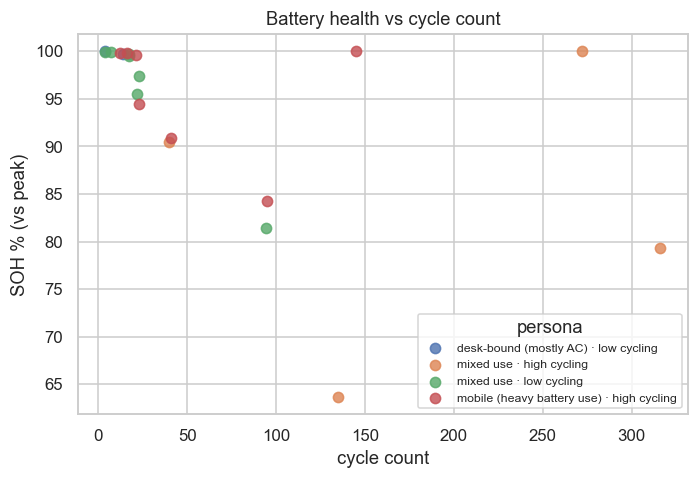

### Usage Landscape

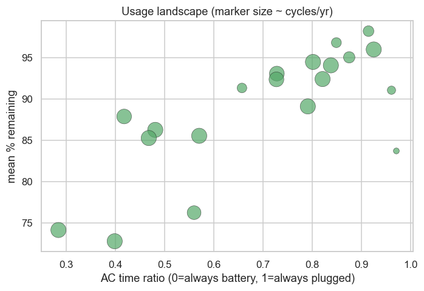

## Usage personas

| persona | users | AC time ratio | mean % rem. | cycles/yr | SOH % (peak) |
|---|---|---|---|---|---|
| desk-bound (mostly AC) · low cycling | 2 | 0.97 | 87.39 | 7.58 | 99.88 |
| mixed use · high cycling | 4 | 0.84 | 92.90 | 93.37 | 83.38 |
| mixed use · low cycling | 7 | 0.79 | 94.48 | 39.56 | 96.23 |
| mobile (heavy battery use) · high cycling | 7 | 0.45 | 81.17 | 96.75 | 95.56 |

## Per-user metrics

| display_id | device_model | observation_days | n_samples | soh_peak_pct | soh_design_pct | capacity_fade_pct | cycle_count_last | cycles_per_year | ac_time_ratio | mean_pct_remaining | n_discharge_sessions | mean_dod_pct |
|---|---|---|---|---|---|---|---|---|---|---|---|---|
| user_f9331e47 | ThinkPad T14 Gen 1 | 604.27 | 12743 | 100.00 | 101.94 | 0.00 | 272.00 | 96.11 | 0.84 | 94.08 | 441 | 24.76 |
| user_7ec11193 | ThinkPad X1 Carbon Gen 10 | 140.28 | 669 | 100.00 | 103.35 | 0.00 | 4.00 | 2.60 | 0.97 | 83.72 | 4 | 8.00 |
| user_c409957b | ThinkPad X1 Yoga Gen 8 | 297.49 | 4877 | 100.00 | 101.00 | 0.00 | 145.00 | 147.33 | 0.48 | 86.27 | 383 | 21.04 |
| user_12fdf7f5 | ThinkPad T14s 2-in-1 Gen 2 | 34.13 | 413 | 99.97 | 100.02 | 0.03 | 4.00 | 21.40 | 0.85 | 96.83 | 14 | 10.71 |
| user_0ce5442c | ThinkPad X1 Carbon Gen 14 | 32.91 | 528 | 99.90 | 99.95 | 0.10 | 7.00 | 66.59 | 0.80 | 94.49 | 23 | 17.35 |
| user_a1f62ae3 | ThinkPad T14s Gen 6 | 46.10 | 511 | 99.86 | 100.57 | 0.14 | 16.00 | 55.46 | 0.42 | 87.89 | 21 | 20.81 |
| user_b9fd8d46 | ThinkPad T14 Gen 7 | 27.78 | 291 | 99.82 | 100.02 | 0.18 | 12.00 | 118.35 | 0.28 | 74.15 | 20 | 37.55 |
| user_7e125e0c | ThinkPad T16 Gen 4 | 378.01 | 4738 | 99.76 | 99.74 | 0.24 | 14.00 | 12.56 | 0.96 | 91.07 | 16 | 13.62 |
| user_fbfa0d58 | ThinkPad P16s Gen 5 | 109.96 | 1470 | 99.72 | 99.73 | 0.28 | 17.00 | 56.47 | 0.73 | 93.08 | 55 | 24.27 |
| user_c70ce5c2 | ThinkPad T14s Gen 6 | 152.67 | 1190 | 99.62 | 99.67 | 0.38 | 21.00 | 47.85 | 0.56 | 76.25 | 62 | 23.52 |
| user_5bdc1482 | ThinkPad T14 Gen 6 | 314.74 | 1033 | 99.56 | 99.56 | 0.44 | 17.00 | 19.73 | 0.66 | 91.34 | 59 | 22.66 |
| user_cdd66a67 | ThinkPad P1 Gen 8 | 253.00 | 2703 | 97.42 | 100.83 | 2.58 | 23.00 | 30.32 | 0.88 | 95.05 | 67 | 17.63 |
| user_dbff3fbc | ThinkPad T14s Gen 6 | 225.07 | 6204 | 95.56 | 94.60 | 4.44 | 22.00 | 25.97 | 0.91 | 98.22 | 138 | 7.70 |
| user_1694e77c | ThinkPad X1 Carbon Gen 13 | 48.99 | 699 | 94.42 | 98.47 | 5.58 | 23.00 | 164.01 | 0.57 | 85.55 | 43 | 34.77 |
| user_b658fcf7 | ThinkPad T14s 2-in-1 Gen 1 | 236.90 | 1225 | 90.93 | 92.61 | 9.07 | 41.00 | 61.67 | 0.40 | 72.79 | 78 | 40.60 |
| user_a7f2cf3b | ThinkPad P16 Gen 3 | 224.02 | 7861 | 90.52 | 90.51 | 9.48 | 40.00 | 60.33 | 0.93 | 96.00 | 72 | 29.43 |
| user_911260b9 | ThinkPad T14s Gen 5 | 411.51 | 3643 | 84.28 | 84.30 | 15.72 | 95.00 | 82.55 | 0.47 | 85.28 | 237 | 31.72 |
| user_11d0f648 | ThinkPad X13 2-in-1 Gen 5 | 608.07 | 7586 | 81.46 | 81.86 | 18.54 | 94.00 | 56.46 | 0.73 | 92.38 | 289 | 20.29 |
| user_d6db2459 | ThinkPad P1 Gen 5 | 933.23 | 16556 | 79.34 | 82.35 | 20.66 | 316.00 | 123.29 | 0.79 | 89.11 | 623 | 39.58 |
| user_547c80a2 | ThinkPad X13 Gen 5 | 518.12 | 7853 | 63.66 | 63.71 | 36.34 | 135.00 | 93.76 | 0.82 | 92.42 | 284 | 34.86 |

## Per-user detail (sample)

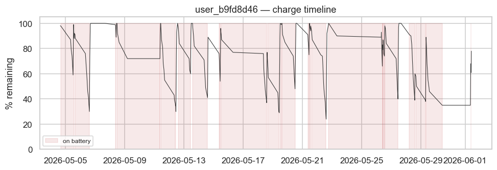

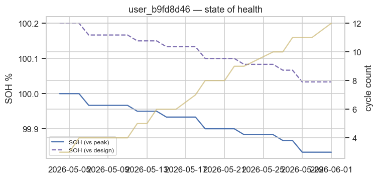

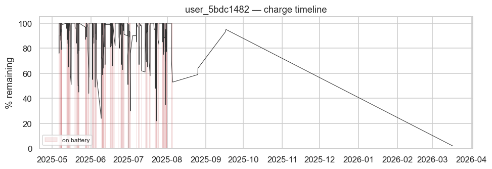

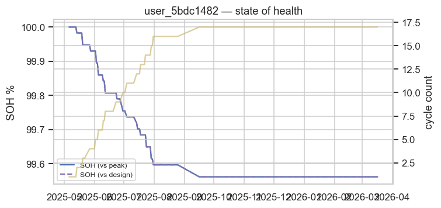

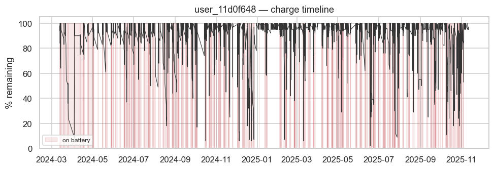

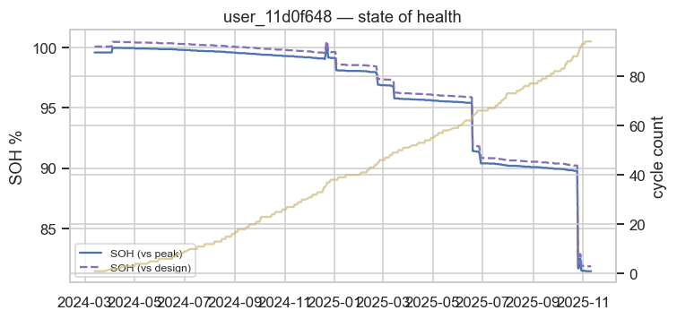

---

### Notes & caveats

- `acdcMode`: 1 = on AC, 0 = on battery (confirmed against capacity trend).
- SOH (vs peak) uses the highest observed full-charge capacity as the healthy reference; SOH (vs design) uses the battery's design capacity. New packs can read >100%.
- `ac_time_ratio` and other time-weighted ratios cap inter-sample gaps at 2.0 h to avoid counting logger-asleep periods.
- Battery time-series files are cumulative; only the latest per user is analysed.
- `fade_pct_per_year` / `fade_pct_per_100_cycles` are *post-peak* rates (fade since the healthiest observed sample over the interval since that sample); short post-peak spans are suppressed to avoid noise.
- Users are shown by pseudonymous `display_id`; the raw id mapping stays in the git-ignored `cohort_features.csv` / `manifest.json`.
- Cohort selection is seeded random over users with real history — not a uniform sample of the whole fleet.
